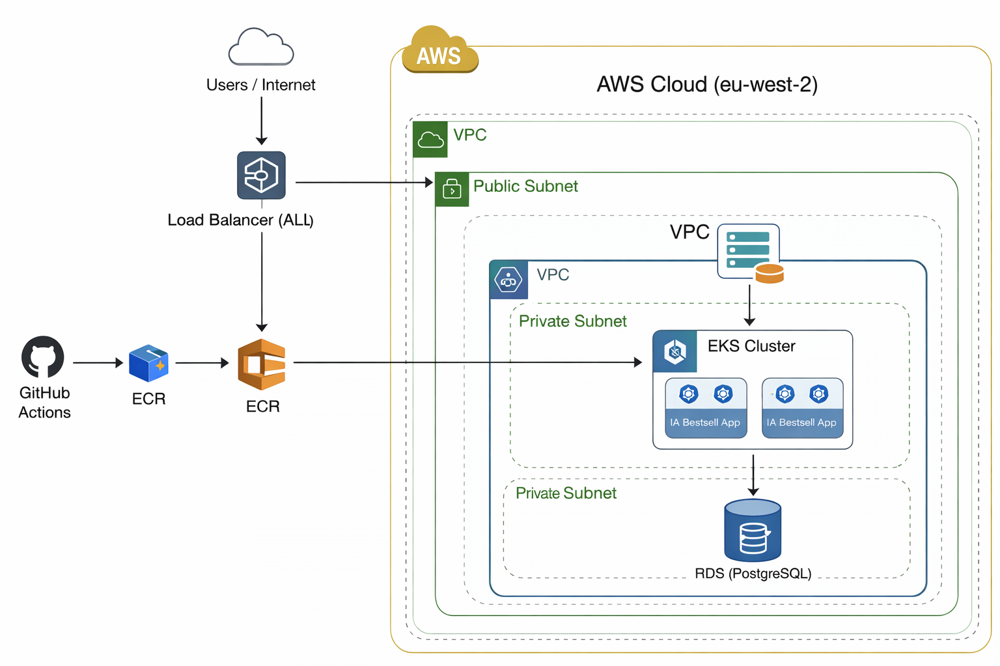

# 🚀 EKS Production Platform – IA Bestsell Logistics


## 📌 Overview

This repository provides a **production-grade Infrastructure and Application deployment platform** for IA Bestsell Logistics, built on AWS using modern DevOps practices.

It demonstrates how to design, provision, and operate a **secure, scalable Kubernetes environment (Amazon EKS)** using Infrastructure as Code and automated CI/CD pipelines.

The platform is fully automated using **Terraform for infrastructure provisioning**, **Docker for containerization**, and **GitHub Actions with OIDC for secure deployments**, eliminating the need for static credentials

---

## 🎯 Project Purpose

This project simulates a real-world logistics platform and showcases:

### 🚧 Infrastructure & Application Integration
- End-to-end setup from infrastructure provisioning → container build → Kubernetes deployment
- Separation between infrastructure (`Terraform`) and application (`Flask API`)

### ☁️ Production-Ready Architecture
- EKS deployed in **private subnets** for security
- Public-facing **Application Load Balancer**
- Managed database using **Amazon RDS (PostgreSQL)**
- Scalable and fault-tolerant design

### ⚙️ DevOps Best Practices
- CI/CD pipelines using **GitHub Actions**
- Secure authentication via **OIDC (no access keys)**
- Automated Docker build and push to **Amazon ECR**
- Rolling deployments to Kubernetes

### 🔐 Security & Reliability
- IAM roles with least privilege access
- No hardcoded secrets or credentials
- Health checks and self-healing Kubernetes pods

---

## 🧠 What This Project Demonstrates

- Designing a **real production cloud architecture**
- Implementing **secure CI/CD pipelines**
- Deploying and managing workloads on **Kubernetes (EKS)**
- Troubleshooting real-world issues across:
  - Terraform
  - AWS networking
  - Kubernetes deployments
---

## 🧱 Architecture



---

## ⚙️ Tech Stack

- **Cloud:** AWS (EKS, VPC, RDS, ECR)
- **Infrastructure as Code:** Terraform
- **Containers:** Docker
- **Orchestration:** Kubernetes (EKS)
- **CI/CD:** GitHub Actions (OIDC)
- **Backend:** Python (Flask)

---

## 🚀 Features

- Secure CI/CD with **OIDC (no static credentials)**
- Dockerized application deployed to EKS
- Load-balanced Kubernetes service
- Infrastructure fully managed with Terraform
- Rolling updates and self-healing pods

---

## 📦 Project Structure

```eks-production-infra/
│
├── app/ # Application code (Flask API)
│ ├── app.py
│ ├── Dockerfile
│ └── requirements.txt
│
├── k8s/ # Kubernetes manifests
│ ├── deployment.yaml
│ ├── service.yaml
│ └── namespace.yaml
│
├── infra-live2/ # Terraform root configuration
│
├── modules/ # Reusable Terraform modules
│ ├── vpc/
│ ├── eks/
│ ├── ecr/
│ └── database/
│
├── .github/workflows/ # CI/CD pipelines
│ ├── ci.yml
│ └── cd.yml
│
├── architecture-diagrams/ # System design diagrams
│ └── eks-architecture.png
│
└── README.md
```

---

## 🔄 CI/CD Pipeline

### CI
- Runs on push / PR
- Installs dependencies
- Runs tests

### CD
- Authenticates via **OIDC**
- Builds Docker image
- Pushes to ECR
- Deploys to EKS
- Performs rolling update

---

## 🔐 Security

- No hardcoded credentials
- OIDC authentication for GitHub Actions
- IAM least privilege access
- Environment-based secrets management

---

## 🧠 Challenges

- Fixed container crash issues (port binding)
- Resolved EKS scheduling constraints
- Handled Terraform dependency errors during destroy
- Implemented secure authentication using OIDC

---

## 📌 Key Takeaways

- Built and deployed a production-style Kubernetes platform
- Implemented secure CI/CD without static credentials
- Gained hands-on experience debugging real cloud issues

---

## 👤 Author

**Iskandar Nuhu**  
Cloud / DevOps Engineer  
AWS | Kubernetes | Terraform | CI/CD
